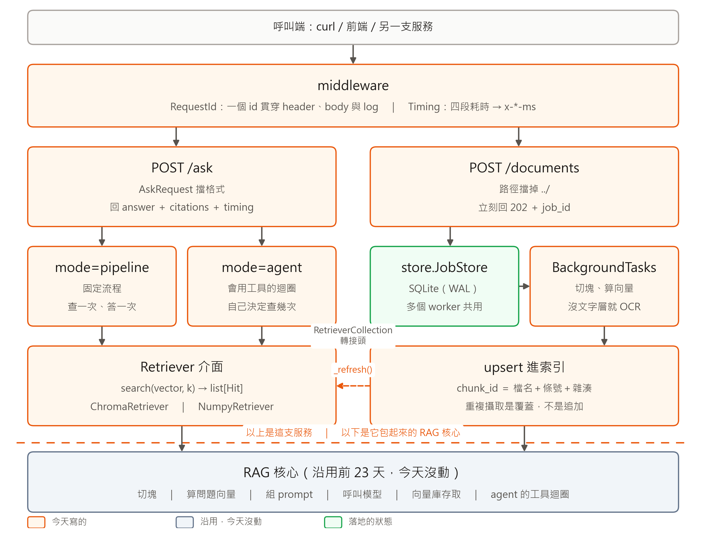
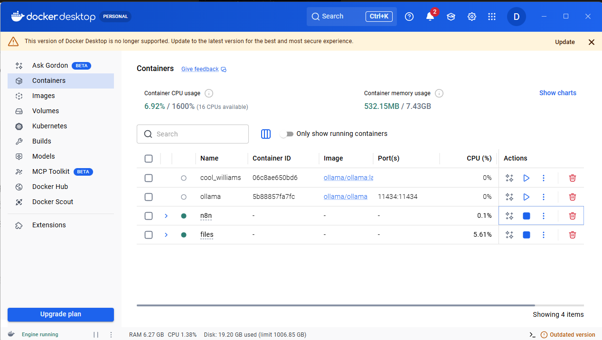

# [Day 25] 那一行跑了 23 天沒出過事，多一個人用就開始吐 500

> 服務那兩篇的下篇。上篇走 `/ask`，這篇走另外半支：文件怎麼進來、
> 狀態放哪裡、一次請求的時間花在哪一段。



上篇走圖的左半邊，這篇走右半邊，外加底下那條共用的快取。這是本系列第 25 篇。

## 一、`ingest.py`：把一份文件變成索引裡的塊

| 函式 | 做什麼 |
| --- | --- |
| `read_document(path, ocr)` | 依副檔名分流：markdown 直接讀，PDF 有文字層用 `fitz`，沒有就走 OCR |
| `chunk_id(source, meta, text)` | 算出一塊在索引裡的身分：檔名＋條號＋內容雜湊 |
| `run(store, job_id, upsert, on_done)` | 背景執行緒跑的攝取流程，一路維護 job 狀態 |

OCR 很慢，一份 20 頁的掃描 PDF 要 277 秒，所以 `POST /documents` 只登記 job 就回 202。

`chunk_id` 是這篇第一個修好的東西：

```python
def chunk_id(source: str, meta: dict, text: str) -> str:
    digest = hashlib.sha256(text.encode("utf-8")).hexdigest()[:8]
    return f"{Path(source).name}:{meta.get('article_no', 0)}:{digest}"
```

第一版是 `f"job-{job_id}-{i}"`。每次攝取都是新的 job_id，同一份文件攝取兩次，
索引就從 59 塊變 118 塊，檢索開始撈到重複條文。**id 要由內容決定，不是由這次呼叫決定**，
配上 `upsert`，重複攝取就變成覆蓋。

`run()` 的狀態是 `queued → running → done／failed`。檔案不存在算 job 失敗、
不算 POST 失敗，因為呼叫端要先拿到 `job_id` 才查得到原因。

## 二、`store.py`：job 狀態存哪裡

| 方法 | 做什麼 |
| --- | --- |
| `create(path, ocr)` | 開一個 job，狀態 `queued`，回傳含 `job_id` 的整筆 |
| `get(job_id)` | 查一筆，查不到回 `None`（端點據此回 404） |
| `update(job_id, **fields)` | 改狀態、塊數、耗時或錯誤訊息 |
| `recent(limit)` | 最近的 job，給 `GET /documents` 用 |
| `purge(older_than)` | 清掉過期的 job |
| `exclusive(timeout)` | 跨行程互斥鎖，攝取寫索引時用 |
| `close()` | 關掉這條執行緒的連線，`lifespan` 收尾時呼叫 |

第一版放在行程記憶體的 dict 裡。`uvicorn --workers 4` 一下去，
A 收下的 `job_id` 打到 B 就查不到，回 404。

換成 SQLite，WAL 模式，多個行程可以同時讀，而寫很少，一個 job 只寫三次。
`exclusive()` 借 `BEGIN IMMEDIATE` 當鎖用：Chroma 內嵌模式不是設計給兩個行程同時寫的。
連線是 thread-local 的，`sqlite3` 的連線不能跨執行緒。

## 三、`cache.py`：換掉那個會壞的存檔

兩個快取檔，存算過的問題向量與問過的答案。存法是整包讀進來、改一個 key、整包寫回去：

```python
def _save_json(path: Path, data: dict) -> None:
    path.write_text(json.dumps(data, ensure_ascii=False), encoding="utf-8")
```

這一行整個系列都在用，一次都沒錯過。服務有兩條執行緒同時走到它，一條讀到寫到一半的檔案：

```
UnicodeDecodeError: 'utf-8' codec can't decode byte 0x90 in position 393
```

`rag_core.py` 是前 23 天的證據不能改，所以在啟動時換掉那兩個函式。

| 函式 | 做什麼 |
| --- | --- |
| `install()` | 把 `rag_core` 的讀寫換掉，回傳實際用到的後端名字 |
| `uninstall()` | 換回去 |
| `warm(*paths)` | 啟動時先備好快取，不要讓第一個使用者付這筆錢 |
| `stats()` | 現在有幾筆、用哪個後端，`/healthz` 會帶回去 |
| `export(path)` | 把快取倒回 JSON 檔 |

換成什麼？放回檔案只會再壞一次，放進 process 記憶體則是開第二個 worker 就各存各的。
要兩個都避開，快取得搬出這支程式。

### Redis 是什麼、在這裡做什麼

一個獨立跑的資料庫，資料放記憶體裡所以快，只做一件事：給它 key，還你 value。
不能下 SQL，不能 join。重點是**它是另一支程式**，不在你的 process 裡——
服務透過網路去問它，所以幾個 worker、幾台機器問，拿到的都是同一份。
在這裡它就存那兩個快取，那是花錢跟 OpenAI 換來的東西。

| 放哪 | 誰看得到 | 服務重啟 |
| --- | --- | --- |
| 檔案 | 都看得到，但會互相寫壞 | 還在 |
| process 記憶體 | 只有自己那個 worker | 沒了 |
| Redis | 所有 worker、所有容器 | 還在 |

`rag_core.py` 一個字都沒改：它對快取只做查 key、拿值、設值、存檔四件事，
塞一個行為像 dict、實際上在跟 Redis 講話的東西進去就行。

兩個決定：**Redis 掛了要變慢變貴、不是變 500**，讀寫失敗一律當沒命中；
**版控裡那兩個 JSON 還是要有用**，啟動時拿它當種子灌進去，已經有的不覆蓋。

### 跑起來



`/healthz` 會回 `"cache": {"backend": "redis", "keys": 1644}`，不用翻 log
就知道有沒有默默降級。同一題問四次，第四次是把服務容器砍掉重建之後問的：

| 第幾次 | embed | llm | total | 命中 |
| --- | --- | --- | --- | --- |
| 1（冷） | 3820.2 ms | 2213.4 ms | 6082.0 ms | 否 |
| 2 | 1.5 ms | 0.8 ms | 11.5 ms | 是 |
| 3 | 0.8 ms | 0.6 ms | 11.2 ms | 是 |
| 4（新容器） | 0.9 ms | 1.1 ms | 15.4 ms | 是 |

四次答案一樣。第四次是重點：容器換掉了，快取還在。

## 四、`timing.py`：把一次請求拆成四段

| 函式 | 做什麼 |
| --- | --- |
| `stage(name)` | 配 `with` 用，量一段並累加到這次請求的桶子 |
| `record(name, ms)` | 已經自己量好了，直接記進去 |
| `current()` / `reset()` | 取出或清空這次請求的桶子 |
| `breakdown(total_ms)` | 攤成回應要的形狀，並算出 `overhead` |
| `TimingASGIMiddleware` | 每個請求進來清桶子，出去時寫進 `x-*-ms` header |

桶子放在 `contextvars`：用模組層級的 dict 會在並發時互相加到對方身上。

`stage()` 配 `with` 用。`@contextmanager` 讓一個函式能被 `with` 呼叫，
`yield` 上面那半在進去時跑、下面那半在出來時跑——就像 `with open()` 會自動關檔：

```python
@contextmanager
def stage(name: str):
    t0 = time.perf_counter()      # 1. 進 with 時跑
    try:
        yield                     # 2. with 區塊裡的程式碼在這裡跑
    finally:                      # 3. 出來時跑，第 2 步爆掉也會跑
        bucket = current()
        bucket[name] = bucket.get(name, 0.0) + (time.perf_counter() - t0) * 1000

with stage("llm"):                # → 1
    answer = rag_core.chat(prompt)  # → 2，然後 3
```

第 3 步寫在 `finally` 裡，因為出錯的請求往往正是你想知道它慢在哪的。

兩個細節：同一段量兩次會相加（agent 一題會打好幾次模型，要的是總和）；
用 `perf_counter()` 不用 `time.time()`，後者會被系統校時往回調。

28 題打一輪真的呼叫 API，服務自己回報的中位數：

| 段 | 中位數 | 佔比 |
| --- | --- | --- |
| 算問題向量 | 211 ms | 15.7% |
| 檢索 | 19 ms | 1.4% |
| LLM | 1,054 ms | 78.1% |
| 序列化 | 0.15 ms | 0.01% |

## 五、`main.py`：啟動順序與兩層鎖

| 函式 | 做什麼 |
| --- | --- |
| `lifespan(app)` | 裝常駐快取 → 開 `JobStore` → 建索引 → 把 `ready` 設成 True |
| `_collection()` | 每次都跟 client 重拿 collection，不把 handle 抓在手上 |
| `_refresh()` | 重建兩個 retriever 與「條號 → 原文」的對照表 |
| `_require_ready()` | 索引還沒好就丟 503 |
| `ingest_document()` | 擋路徑、登記 job、丟背景、回 202 |

`ingest_document()` 的順序是：先 `resolve_document()` 擋路徑（不要等到背景才失敗）、
`store.create()` 登記 job、`background.add_task()` 丟出去、回 202。

注入的 `upsert` 寫索引時包在兩層鎖裡：`with _INDEX_LOCK, store.exclusive():`。
前者是 `RLock`，擋同一個行程的其他執行緒；後者擋別的 worker。

`_collection()` 是踩出來的。第一次開三個 worker 丟攝取，9 個 job 死了 2 個：

```
NotFoundError: Collection [003716ce-...] does not exist.
```

那串 UUID 是啟動時拿到的 collection handle，另一個行程把它砍掉重建了。
所以 `_collection()` 每次重拿，而 `ChromaRetriever` 收的也不是 collection 本身，
是一個「去把它拿來」的函式，撞到 `NotFoundError` 就重拿再試。`/ask` 的 handler 一行沒動。

多 worker 實測：`--workers 3`，連丟 9 個攝取 job，9 個都 done，索引維持 59 塊，
任何一個 worker 都查得到任何一個 `job_id`，6 次 `/ask` 全部 200。

## 六、還沒做的

- **攝取收的是路徑，不是上傳的檔案。** 換成 `UploadFile` 的話，job 那一段不用改。
- **agent 請求一次只能跑一個**，原因在上篇第七節。
- **索引在每個 worker 各建一份。** 語料大起來之後應該共用，或改用外部向量庫。
- **Redis 沒設密碼，也沒給 key 設過期。** 它只開在 compose 網路裡，搬到別的機器就得補。

## 明天 Day 26：串流

一題要一秒多，其中 78% 在等模型吐完，在那之前使用者看到一片空白。
明天 `/ask` 多一條 SSE 的路，總時間不會變短，但第一個字出現的時間會。
`citations` 在第一個 token 之前就確定了，可以先送，讓前端先把出處畫出來。

---

**《30 天打造 AI 後端：從 LLM、RAG 到 AI Agent》第 25 篇**

- 系列目錄：<https://ithelp.ithome.com.tw/users/20183569/ironman/9205>
- 程式碼：<https://github.com/wp900622/TrustRAG>（`day24_rag/`）

前 23 天在量語料與檢索，這兩篇是把它們變成一支撐得住第二個使用者的服務。
按左邊我的頭像追蹤，之後每天的會直接出現在你的首頁。
