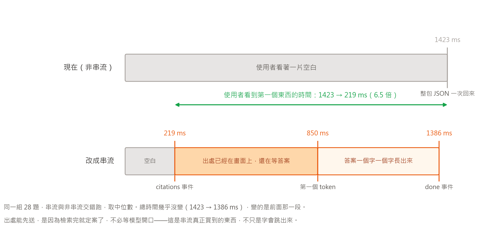

# [Day 26] 使用者關掉分頁走了，我的服務還在幫他付錢

> `/ask` 多一條串流的路。使用者看到第一個東西的時間從 1,423 ms 掉到 219 ms，
> 總時間幾乎沒動。跑之前寫死的五條預測，錯了兩條，其中一條錯在方向。
>
> 不過今天花掉我半天的不是那些數字。我寫了一段處理「客戶端中途走掉」的程式碼，
> 看起來很完整，實測才發現它一次都沒執行過。

---

這是《30 天打造 AI 後端：從 LLM、RAG 到 AI Agent》的第 26 篇。

這支服務把一份公司工作規則（59 段條文）變成問答 API：POST 一個問題，
回答案加出處。前兩篇把散落的腳本收成服務、讓它撐得住第二個使用者，
今天處理的是另一件事：它答得對，但答得讓人想關掉分頁。

## 一、那一片空白的 1.4 秒

Day 25 量過一次請求的四段：

| 段 | 中位數 | 佔比 |
| --- | --- | --- |
| 算問題向量 | 211 ms | 15.7% |
| 檢索 | 19 ms | 1.4% |
| LLM | 1,054 ms | 78.1% |
| 序列化 | 0.15 ms | 0.01% |

78% 在等模型把整段話講完。在那之前畫面上什麼都沒有，
因為現在的做法是等答案整段生完，包成一包 JSON 再回。

1.4 秒聽起來不長，但那是一片空白的 1.4 秒，不是「有東西在動」的 1.4 秒。
這兩件事在使用者那邊差很多，有些人不會等完，他會關掉分頁走人。
這個動作先記著，第四節會回來找它。

而且這一秒四裡還有東西被白白浪費掉：出處在檢索完就定案了。
第 19 毫秒的時候服務已經知道要引用哪三條條文，
卻得陪著模型再等一秒多，才跟答案一起送出去。

## 二、串流是什麼，SSE 又是什麼

模型是一個字一個字生出來的。非串流只是把它們藏起來，
等全部生完才一次給你看。串流就是不藏。

一般的請求與回應：你問一題，伺服器把事情全做完，送一包完整的 JSON，關連線。
中間那一秒多，連線開著但什麼都沒傳。

串流是同一條連線，伺服器有一段就送一段，最後才關。
你看 ChatGPT 打字那樣一個字一個字跳出來，就是這個。

技術上沒有玄機。HTTP 的回應沒有規定要一次送完，
伺服器可以寫一段、沖出去、再寫一段。所以串流不會讓事情變快，
模型該花多久還是多久，它改變的只有東西什麼時候到你眼前。

那 SSE（Server-Sent Events）是什麼？就是「一段一段送」的一種寫法約定，
免得每個人自己發明格式。每個事件兩行加一個空行：

```
event: citations
data: {"citations": [...]}

event: token
data: {"text": "連續請病假"}

event: done
data: {"answer": "...", "usage": {...}, "timing": {...}}
```

瀏覽器有內建的 `EventSource` 會照這個格式幫你拆好，`curl` 也看得到。
比起 WebSocket 它只能單向（伺服器往客戶端），但這裡本來就只需要單向。

事件的順序是這篇的重點。`citations` 排在最前面，
在模型還沒開口的時候就送得出去。

## 三、量到的



同一組 28 題（Day 20 起就在用的那組），串流與非串流交錯跑，
同一題自己跟自己比。分兩次跑各自算中位數會被題目難易度洗掉，
也會被當下的網路狀況洗掉。

| | 中位數 | p95 |
| --- | --- | --- |
| 到 `citations` 事件 | 219.2 ms | 274.8 ms |
| 到第一個 `token` | 850.1 ms | 1,032.4 ms |
| 到 `done`（總時間） | 1,386.3 ms | 1,925.8 ms |
| 非串流總時間 | 1,423.1 ms | 2,179.7 ms |

把中間那段拆開：

| 段 | 中位數 |
| --- | --- |
| 算向量＋檢索（到 `citations`） | 219.2 ms |
| 模型的 TTFT（`citations` → 第一個 token） | 631.0 ms |
| 生成期間（第一個 token → 最後一個） | 536.2 ms |

那 631 毫秒是模型在「想」：請求已經送到 OpenAI，第一個字還沒回來。
這段時間以前是純空白，現在使用者至少看得到三條條文。

## 四、代價：請求什麼時候算結束？

串流買到那 6.5 倍，不是白拿的。

非串流的一次請求邊界很乾淨：進來、做完、回一包、結束。你知道它什麼時候開始、
什麼時候結束、成功還是失敗。串流把這個邊界拆開了，**回應在工作做完之前就開始**。


一拆開，三件你本來理所當然的事就不成立。
最貴的是第一件，就是第一節那個關掉分頁走人的使用者。

### 一、使用者走了，沒有人會告訴你

先講最貴的這個，因為我第一版寫錯了，而且錯得很像對的。

原本的產生器是同步的，跟服務裡其他 handler 一致（Starlette 會丟進執行緒池）。
我寫了 `except GeneratorExit` 來記錄斷線，看起來很完整。

實測那段從來沒有執行過。客戶端關掉連線之後，log 裡既沒有斷線警告，
也沒有完成的那一行，產生器就這樣被丟在那裡。同步產生器待在執行緒池裡，
客戶端走掉時它只是不再被拉取，沒有人關它，那段 `except` 是死碼。

代價很實際：模型會把整段生完，錢照付，而沒有人在聽。

改成 async 產生器才收得到 `aclose()`：

```python
async def events():
    ...
    # 一次拉一段。每個 await 都是一個取消點
    kind, payload = await run_in_threadpool(_pull, gen)
```

代價是每一個會阻塞的呼叫都得自己丟進執行緒池，漏掉任何一個都會卡住 event loop。
改完之後實測：

```
客戶端在 3,627 ms 收到第 3 段就關掉
服務端 3,654 ms  WARNING  ask stream 客戶端中途斷線 已送出 5 段／6 字
```

27 毫秒內就偵測到了。服務端送了 5 段、客戶端只讀到 3 段，
差的那兩段是在途中的緩衝。

### 二、狀態碼定死在 200，出錯了改不了

平常出錯回 500 就好。串流不行：header 早就送出去了，狀態已經是 200。
後面炸掉，呼叫端收到的是一串正常的 token 然後連線結束，
它會以為答案就是講到那裡為止。

所以錯誤得用事件講：

```
event: error
data: {"code": "stream_failed", "message": "...", "sent_chars": 12, "request_id": "..."}
```

前端要把「收到 `error`」跟「收到 `done`」當成兩種結局處理。這是串流多出來的負擔，
沒有辦法省掉。

### 三、計時 header 會騙人

`TimingASGIMiddleware` 在 `http.response.start` 的時候寫 `x-total-ms`。
對一般回應那就是全部做完的時刻；對串流，那是還沒開始做的時刻。

實測串流回應的 `x-total-ms` 是 2.88，實際總時間 50.45。
分段的 `x-embed-ms` 那些則整組不見，因為那時候桶子還是空的。

修法是讓 middleware 認出 `text/event-stream` 就不要送那幾個 header。
**寧可不給，也不要給錯的**：一個 2.88 會讓人以為服務快得不得了。
準確的數字放在最後那個 `done` 事件裡。

### 順手改掉的一個鎖

非串流那條抓著 `_INDEX_LOCK` 走完整個請求，沒問題。串流照抄的話，
會抓著它等模型講完話，那一秒多裡攝取完全進不來。
改成只在真的碰索引的那幾行上鎖。

## 五、反轉：快取命中時，串流反而比較慢

這是跑之前就寫下的反轉候選，成立了。

| | 串流 | 非串流 |
| --- | --- | --- |
| 中位數 | 23.5 ms | 21.0 ms |
| 成對差額 | \+2.5 ms，串流較快只有 4/28 題 | |

命中的時候不用等模型，串流就沒有東西可以買，只剩下分段的開銷。

不過我預測的是慢 2～4 倍，實測只慢 1.12 倍。我高估了分段的成本，
把 31 個字切成兩段送，多的那一趟在本機只值 2.5 毫秒。

結論不變，但要說得準一點：**串流買到的是「等模型的時候有東西看」，沒在等就沒得買。**
命中率很高的場景不該預設開串流，不過它的代價也遠比想像的小。

## 明天 Day 27：這一切花了多少錢

今天為了那個斷線的 bug，我第一次認真想「一次沒人在聽的請求值多少錢」，
然後發現我根本不知道分母。快取檔裡現在有一千多筆，全是花錢買來的，
但到底花了多少、快取又省了多少，26 天沒算過。明天把帳算出來。

---

**《30 天打造 AI 後端：從 LLM、RAG 到 AI Agent》第 26 篇**

- 系列目錄：<https://ithelp.ithome.com.tw/users/20183569/ironman/9205>
- 程式碼：<https://github.com/wp900622/TrustRAG>（`day24_rag/`）

按左邊我的頭像追蹤，之後每天的會直接出現在你的首頁。
