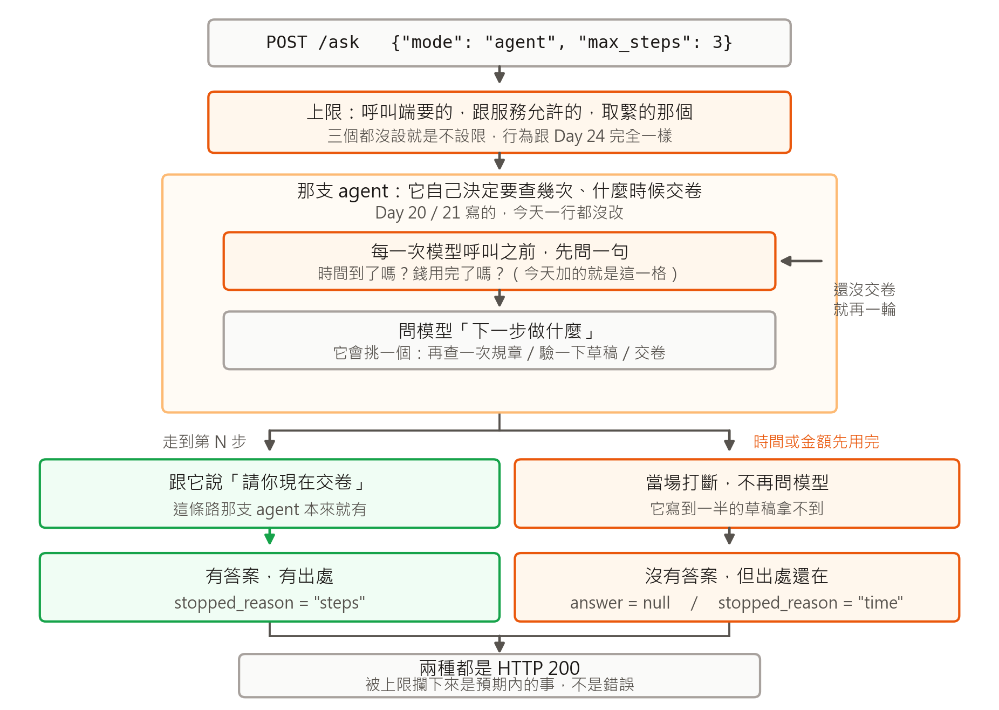

# [Day 28] 我把一個沒有煞車的迴圈掛在 API 上，掛了四天才想起來

> 四天前我把一支會自己查資料的 AI 接進 API，它自己決定要查幾次、什麼時候給答案。
>
> 今天想給它加一個上限，本來以為是一個 if。
> 寫下去才發現「停下來」有兩種意思，而它們回給呼叫端的東西完全不一樣。

---

這是《30 天打造 AI 後端：從 LLM、RAG 到 AI Agent》的第 28 篇。

這篇會用到前面幾天的三個東西，先交代清楚，沒讀過前面幾天也看得懂。

這支服務把一份公司工作規則（59 段條文）變成問答 API：POST 一個問題，回答案加出處。裡面有兩種答法。**第一種是寫死的**：把問題算成向量、去規章裡撈最像的三條、連同問題一起交給模型，請它照著寫答案。一個問題就是一次模型呼叫，時間與花費都是固定的。

**第二種是 agent。** 我不告訴它步驟，只給它三個可以用的動作：查規章、把草稿拿去對一次、交卷。然後在一個迴圈裡反覆問模型「下一步要做什麼」，它回哪個動作我就做哪個，直到它說交卷為止。問「病假連請三天要不要附證明」，它查一次就交卷；問「公司有沒有健身房」，規章裡根本沒這條，它會換好幾種關鍵字一直查下去。

**這支 agent 是三個星期前寫的，而我不能改它。** 它是 Day 20、21 那兩篇文章的實驗證據，動一行，那兩天公布的數字就不可重現。所以從 Day 24 起，我把它當成一個不能修改的第三方套件在用：要調整它的行為，只能在外面包一層。

今天做的事情就是在那層外面加上限。沒有實驗，也沒有預測對帳。收工之後它長這樣：



中間那個大框就是上面說的迴圈，一行都沒改。今天加的只有三處：最上面那一格決定這次的上限是誰說了算，框裡橘色那一格是每次問模型之前的檢查，底下兩個出口是它停下來的兩種方式。

接下來就照著這張圖走一遍，從我發現它根本沒有煞車開始。

## 一、四天前接進去，然後就沒再想過它

Day 24 那天把 agent 接進服務，重點全在「怎麼讓一個不能改的東西跑進來」。它原本直接抓著向量資料庫的物件不放，而服務這一側早就把檢索換成一個介面了，所以我包了一個轉接頭，讓它以為自己還在對著資料庫講話。接起來能問、答案跟腳本時代一樣，我就收工了。

今天要加上限，第一個動作是去找「它最多能走幾步」這個參數。

沒有這個參數。呼叫端能傳的只有兩個東西，要撈幾條條文、以及要不要強迫它交卷前自驗。而「它可以走多遠」寫在那支不能改的檔案裡，是一行模組層級的常數：

```python
MAX_STEPS = 6
```

那個 6 是我三個星期前在腳本裡隨手挑的。腳本時代這樣沒問題，跑的是我自己，我看它繞太久大不了按 Ctrl-C。變成服務之後，按 Ctrl-C 的人不在現場。

平常不會出事，因為大部分問題兩步就結束：查一次、答一次。會出事的是規章裡沒有答案的那種問題。它不會自己放棄，只會換個說法再查一次，查到撞上限為止。Day 21 量過，28 個題目裡有 3 個一路走到那個 6。

而那個 6 從外面看不到也改不了。所以我現在有一個能公開呼叫的端點，裡面跑著一個我無法從外面喊停的迴圈。

## 二、我以為這是一個 if

第一版的想法很單純：數步數，超過就停。寫到一半卡在一個問題上：停下來之後，我要回什麼給呼叫端？

去翻那支 agent 的迴圈，發現它自己就有一條停下來的路。走到第 6 步還沒交卷的時候，它會把一句話推給模型，大意是「你的步數用完了，請直接用手上的資料回答」。也就是說，只要我把 6 改小，就是提早對它說這句話，而它走完這條路是有答案的。

那時間上限呢？時間用完的那一刻，我不能再多花一次呼叫去請它收尾，那一次呼叫正是我要省的東西。剩下的只有一種做法：在它要去問模型之前直接把程式打斷，不讓那次呼叫發生。這種停法沒有收尾，它連一個字都還沒開始寫。

同一個「上限」底下是兩種語意：

| 上限 | 怎麼停 | 停下來還有答案嗎 |
|---|---|---|
| 步數 | 提早跟它說「請你現在交卷」 | 有 |
| 時間 | 下一次問模型之前結算，超過就當場中斷 | 沒有 |
| 金額 | 同上，改看這一題已經花掉多少 | 沒有 |

所以要寫的東西變成圖上那兩個出口，而**停下來的方式決定了呼叫端拿到什麼**。金額那個跟時間走同一條路，今天不展開。

## 三、上限從哪裡來，還有沒人設的時候

這個模組我先寫的不是怎麼限制，而是怎麼在沒人設上限的時候完全不作用。

理由有兩個。一個是這支服務從 Day 14 到現在都是沒有上限在跑的，我今天要是讓預設行為變了一點點，前面每一天量到的東西就不能拿來跟以後比。另一個是這種功能一旦預設就開，別人升級上去才發現自己的請求被砍了一半，那是很討厭的事。

所以三個上限的預設值都是「沒有」，沒人設的時候，這個檔案在請求路徑上只做一件事：確認三個欄位都是空的，然後放行。

```python
@dataclass(frozen=True)
class Budget:
    """一次 agent 請求的三個上限。全 None ＝ 不設限。"""
    max_steps: int | None = None
    max_twd: float | None = None
    max_wall_ms: float | None = None
```

Day 24 那天我在設定檔裡寫過一句話：不設任何環境變數時，這支服務的行為跟前面每一天完全相同。要不要有上限、上限多少，是部署的人的決定。

那麼有人設的時候，聽誰的？圖上最上面那一格解的就是這件事。上限有兩個來源，一個是呼叫端在這次請求裡給的，一個是服務端用環境變數設的天花板。兩邊都可能沒設，也可能都設了，所以要有一條規則：取緊的那個，而且呼叫端不能把自己的上限設得比服務允許的更寬。

```python
def _tighter(asked, ceiling):
    """呼叫端要的跟服務允許的，取緊的那個。服務沒設就用呼叫端的。"""
    if ceiling in (None, 0):
        return asked
    if asked in (None, 0):
        return ceiling
    return min(asked, ceiling)
```

`0` 跟 `None` 在這裡是同一個意思，因為環境變數讀出來是數字，「沒設」只能用 0 表示。這種小地方寫成一個有名字的函式，比散在三個 `min()` 裡好，測試也才咬得住。請求那一側再加三個選填欄位，範圍直接寫在欄位上，超出範圍的請求在碰到 agent 之前就被擋掉：

```python
max_steps: int | None = Field(
    default=None, ge=1, le=12,
    description="只對 agent 有效。它最多可以走幾步；走到就被要求直接作答")
```

服務端的天花板走環境變數，三個預設都是 0，也就是不設限：

| 變數 | 預設 | 意思 |
|---|---|---|
| `DAY24_AGENT_MAX_STEPS` | `0` | 它最多走幾步 |
| `DAY24_AGENT_MAX_TWD` | `0` | 一題最多花多少 |
| `DAY24_AGENT_MAX_WALL_MS` | `0` | 一題最多跑多久 |

打起來是這樣：

```bash
curl -s -X POST http://127.0.0.1:8024/ask \
  -H 'Content-Type: application/json' \
  -d '{"question":"公司有健身房嗎？","mode":"agent","max_steps":3}'
```

## 四、檢查點只掛一個地方

圖裡面那一格「每一次問模型之前，先問一句」，實作上只有一行。

Day 24 為了量時間，寫過一層包裝：進到 agent 之前，把它對外的三個出口暫時換成我的版本，離開時換回去。今天的檢查就掛在其中一個出口的最前面，也就是它每次要去問模型的那個動作：

```python
def chat_tools(messages, *args, **kwargs):
    # 上限只在這裡檢查。問模型是這支 agent 唯一會「花掉時間與錢」的動作，
    # 其餘（查規章、算向量）都在它的陰影底下
    if guard is not None:
        guard.check()
    ...
```

檢查本身很短，兩個 if 而已：

```python
def check(self) -> None:
    """下一次問模型之前。超過就中斷，沒超過就放行。"""
    self.calls += 1
    if self.budget.max_wall_ms is not None \
            and self.elapsed_ms >= self.budget.max_wall_ms:
        raise BudgetExceeded("time", self.calls, self.spent_twd, self.elapsed_ms)
```

只掛在問模型之前，有一個直接的後果要寫進文件：實際耗時與實際花費會超過上限，最多超過一次呼叫的量。上限是在下一次呼叫之前結算的，要分毫不差就得在呼叫出去之前知道那一次會跑多久，我沒有辦法。

另外，中斷用的那個例外刻意不掛在服務既有的錯誤家族底下。掛上去的話它會被錯誤處理器接走，變成一個 4xx 或 5xx 的回應，而我還沒想好被上限攔下來算不算錯誤。

圖左邊那個出口沒有新東西要處理。把上限換小、讓那支 agent 走它自己那條交卷的路，回傳值是完整的，用完再換回去就好：

```python
@contextlib.contextmanager
def step_cap(max_steps: int | None):
    if max_steps is None:
        yield
        return
    original = agent21.MAX_STEPS
    agent21.MAX_STEPS = max(1, int(max_steps))
    try:
        yield
    finally:
        agent21.MAX_STEPS = original
```

在外面改模組上的常數、用完還原，看起來很土，但它是「不能改那支檔案」這個限制下唯一乾淨的做法。Day 24 換「要撈幾條條文」的時候就是這樣做的，今天只是多一個。

## 五、直接打斷的那條路，第一版什麼都沒帶回來

先講正常結束的時候會發生什麼事。那支 agent 跑完一題，最後會回一包東西給我，裡面有它寫的答案、它一路查到的條號、查了幾次、問了模型幾次。服務就是拿這包東西去組回應的。

打斷的做法是在它要去問模型之前丟出一個例外。例外一丟，程式就從迴圈中間跳出去，那支 agent 的函式根本沒跑到最後那一行 return。也就是說，上面講的那包東西從來沒有被組出來。它剛剛查到的條號、查了幾次，全都只是那個函式裡的區域變數，跟著例外一起消失。

第一版就是這樣，跑起來看到的回應是空的：沒有答案，也沒有出處。停下來是停下來了，但呼叫端什麼都沒拿到。

補救的地方在轉接頭。第一節提過，那支 agent 不會自己去碰檢索，它每次查規章都是呼叫我包的那個轉接頭，由轉接頭去問服務的檢索、再把結果轉成它認得的格式。也就是說，**每一條被查出來的條文，一定會經過這個轉接頭**。那就讓它在經手的時候順便記下來：

```python
class RetrieverCollection:           # 讓那支 agent 以為自己在對資料庫講話
    def query(self, query_embeddings, n_results, include=None) -> dict:
        hits = self._retriever.search(...)     # 真正去查的地方
        self.searches += 1                     # 今天加的兩行
        self.article_nos += [h.meta["article_no"] for h in hits]
        return {...}                           # 轉成它認得的格式
```

這樣一來，例外跳出去之後，我手上還有一份「它剛剛查到哪些條文、查了幾次」。服務就自己組一包跟正常情況同樣形狀的東西回去，答案那一欄留空。

實際打一次。為了確定一定會觸發，我把時間上限設成 20 毫秒，那大概只夠它查一次規章：

```json
{"answer": null,
 "citations": [{"article_no": 24, "title": "病假", ...},
               {"article_no": 25, ...}, {"article_no": 29, ...}],
 "agent": {"searches": 1, "steps": 1,
           "stopped_reason": "time", "stopped_at_step": 2},
 "mode": "agent"}
```

`steps` 是 1、`stopped_at_step` 是 2，看起來矛盾，其實是兩件事：它完整走完了第 1 步（問模型、模型說要查規章、查完），正要開始第 2 步的時候被攔下來。所以完成的是 1 步，停在第 2 步。

`answer` 是 `null` 而不是一段半成品。它寫到一半的草稿只活在那支 agent 的區域變數裡，跟上面那些條號一樣拿不到，而我不想自己拼一段像答案的東西塞進去。

拿到這包回應的前端可以直接把那三條條文列出來，告訴使用者「這次超時了，但這是它查到的規章」。跟一個全空的回應比起來，這是差很多的兩種畫面。

## 六、那要回幾號

寫到這裡才輪到狀態碼。直覺是 504 或 429 之類的，被上限攔下來聽起來就該是個錯誤。

但看著上面那包 JSON 就講不下去了。錯誤的格式是 Day 24 定的，裡面只有三個欄位：代號、給人看的訊息、以及這次請求的編號。沒有一個放得下那三條條文。要塞的話就得在錯誤裡開一個放資料的欄位，那等於承認它根本不是錯誤。

另一個角度更直接：狀態碼是給呼叫端判斷「要不要重試」的。同一個請求重試一次，一樣會撞到同一個上限。它不是一個暫時的失敗。

所以圖最底下那一格是兩條出口共用的：被上限攔下來回 200，回應裡多兩個欄位講清楚發生什麼事，一個是為什麼停（步數、時間、金額），一個是停在第幾步。

呼叫端要判斷就讀這兩個欄位，不要讀狀態碼。我對這個決定沒有很有把握，「200 代表成功」是很多人寫 client 時的預設假設，這樣做等於要求對方多讀一層。最後說服我的是那包 JSON 裡的三條出處。

## 七、我怕什麼就測什麼

新增 10 個測試，服務那一包從 56 變成 66，全部走既有的快取，不打 API。挑兩個：

```python
def test_default_is_unlimited():
    """預設不能改變既有行為：三個欄位都沒給就是不設限。"""
    assert budget.resolve().unlimited


def test_step_cap_does_not_leak(client):
    """改的是模組常數，離開請求要還原，不然下一個人拿到別人的上限。"""
    agent_ask(client, question=LONG_QUESTION, max_steps=2)
    assert agent21.MAX_STEPS == 6
```

第二個是今天最該有的一個。上一節那個「在外面改常數」的做法是整個行程共用的，也就是說我改的那一下，同時間進來的別人也會被改到。現在不會出事，是因為 agent 這條路一次只放一個請求進來，而那把鎖是 Day 24 為了量時間才加的，跟上限沒有關係。哪天有人覺得那把鎖沒用把它拿掉，這個測試會先叫。

去確認那把鎖的時候，順手發現另一件事：這支服務的問答本來就是一次一個，因為外面還有一把更大的鎖抓著整段請求。我在一條已經是單行道的路上又立了一個號誌。要真的能同時跑，得把檢索與向量那兩塊注入那支 agent，而那要改它的程式碼，所以今天沒動，只寫進 README 的「還沒做的」。

同一份清單上還有一條是今天寫下去的：上限該設幾步、品質會不會掉。那個問題要一組有標準答案的題目才量得出來，不是一個模組能回答的。

## 明天 Day 29：這 26 天的向量資料庫

Day 24 把檢索抽成介面的時候，我順手寫了一個對照組：不碰任何資料庫，用四行 numpy 直接算 59 條條文的相似度。28 個題目撈到的前三條、以及最後的答案，跟走資料庫完全相同。

也就是說這 26 天我一直帶著一個向量資料庫，而它在這份語料上做的事，四行程式也做得到。明天談它：什麼時候它是必要的，什麼時候它只是預設選項，以及除了速度以外，它還替我擋了什麼。

---

**《30 天打造 AI 後端：從 LLM、RAG 到 AI Agent》第 28 篇**

- 上一篇：[Day 27：我調了 13 天的檢索，佔帳單的 0.11%](（待補：Day 27 的 ithelp 連結）)
- 系列目錄：<https://ithelp.ithome.com.tw/users/20183569/ironman/9205>
- 程式碼：<https://github.com/wp900622/TrustRAG>（`day24_service/budget.py`）

按左邊我的頭像追蹤，之後每天的會直接出現在你的首頁。
