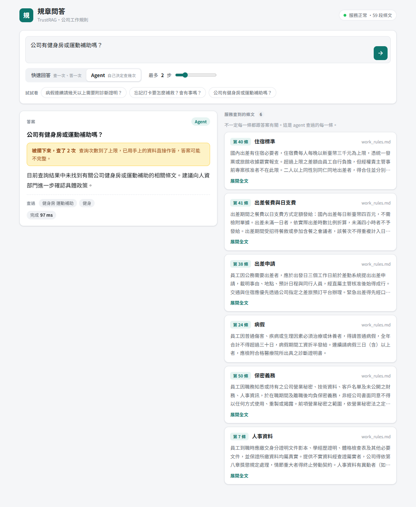

# [Day 30] 完賽感想：30 天、NT$27 的 API 費，和一個一直猜錯的我

> 最後一天不寫新功能了，寫感想。
>
> 30 天前，這個系列是一個資料夾，裡面放著幾支各自能跑的實驗腳本。今天它是一支有 98 個測試的服務，人可以用網頁問，別人的 AI Agent 可以透過 MCP 呼叫。
>
> 中間發生最多次的事，是我猜錯。

---

《30 天打造 AI 後端：從 LLM、RAG 到 AI Agent》第 30 篇，最後一篇。

這個系列從頭到尾只做一件東西：一個規章問答 API。背後是一份 59 條、我自己編的公司工作規則，問它「病假連請三天要不要附證明」，它回答案，也回它查到的條文。前半在調檢索和評估，中間讓 agent 自己決定要查幾次，後半把散落的腳本收成一支 FastAPI 服務，加上串流、快取、帳本、停損。

## 我立下的規矩，和它帶來的麻煩

這個系列我給自己定了一條規矩：每一篇都要有一個自己跑出來的數字，而且要在跑之前先把預測寫死，跑完逐條對帳，錯的照寫。

這條規矩讓每一篇都變慢。有的日子跑完發現預測錯了一半，原本想好的標題整個不能用。可是回頭看，這個系列裡我自己最常引用的，全都是猜錯的那幾天：

| 天 | 我以為 | 量到 |
|---|---|---|
| Day 14 | 檢索的第一名要是對的條文，答案才會對 | top-1 命中 10/15，答案 15/15 |
| Day 17 | 撈回來的相關條文越多，答得越好 | recall 從 62% 到 88%，答對從 5/8 掉到 3/8 |
| Day 18 | 請模型改考卷，這把尺可以信 | 它跟我自己的判斷只有 15/40 一致 |
| Day 20 | agent 會比寫死的管線聰明 | 24 比 24，agent 貴 4.4 倍 |
| Day 21 | 讓它交卷前自己驗一次，會抓到錯 | 驗了 24 次，22 次回「通過」 |
| Day 22 | 決定成敗的是模型 | 同一份規章，PDF 有文字層 24/28，轉成圖再 OCR 18/28 |
| Day 24 | 我調了十幾天的檢索是瓶頸 | 一次問答裡檢索佔 1.4%～1.6%，模型佔 78.1% |
| Day 27 | 省錢要讓答案短一點 | 26 天花 NT$27.04，輸入佔 89.9%，向量只佔 0.11% |

最痛的是 Day 24 那一格。我從 Day 8 到 Day 17 大多在調檢索，切塊、索引、向量資料庫、召回率，一直到把一次請求拆開量延遲，才知道那一段只佔 1.4%～1.6%。後來算帳單，它佔 0.11%。那十幾天不是白做，Day 14 和 Day 17 的反轉都是那時候量到的，但如果第一天就先拆一次延遲，整個系列的順序會完全不同。

Day 18 則是讓我不太舒服的一天。那把請模型改考卷的尺，我已經拿它下了四天結論，結果它跟我自己的判斷只有 15/40 一致。後來只能用最笨的方法，自己標 40 題，一題一題對，Day 19 才修到 31/40。如果這 30 天只能帶走一個習慣，我會選這個：自動化的評估，先拿一小批自己看過的答案對一次再用。

整個系列的 API 費用加起來是 NT$27.04，比一杯咖啡便宜。最貴的反而是時間。

## 寫文章比寫程式難

程式寫錯，測試會紅。文章寫錯，沒有東西會紅，只會沒有人看。

有幾篇我改到第六、七版才發。回頭看被我自己退掉的版本，問題幾乎都是同一類：

- 寫成日記。 Day 29 的第一版是我追一個 bug 的過程，bug 是真的，但讀者沒有理由在乎我的服務。改成讀者會問的問題「你的 RAG 真的需要向量資料庫嗎」之後，篇幅少了一半，重點反而清楚了。
- 系列叫後端，文章裡卻沒有後端。 有兩篇只有量測和分析，一行服務的程式碼都沒有，對不起系列名。之後每一篇就算是分析，也要有東西被寫出來。
- 太像機器寫的。 粗體太多、每一段都用一句金句收尾、三個排比接著三個排比。拆掉之後句子長短不一，讀起來才像人。
- 結論藏太後面。 有量測結果的日子，讀者要的是數字，我卻先鋪了三節背景。

標題也是。Day 28 我寫的是 agent，內文 agent 出現三十次，標題一次都沒有，那篇上架後只有 18 次瀏覽。沒有人知道那是一篇 agent 的文章。

## 數字之外的數字

我從 Day 23 開始記瀏覽數，本來是想知道文章是不是越寫越差。

9 月 18 日那次紀錄裡最高的是 Day 16，118 次，一篇講「規章沒寫，模型卻自己補了一個數字」的文章。最低的幾篇在十幾次。Day 24 發布兩小時就有 32 次，那是我第一次寫「這東西怎麼做」而不是「我量到什麼」。記到 9 月 19 日那天，系列訂閱 2 人，Like 和留言都是 0。

看到 0 的時候很難不在意。但記錄裡每天都還有少量的人從列表和搜尋點進來，只是沒有人留下任何動作。我後來想通的是，這種系列的讀者大概不是會按讚的人，他們是某天在搜尋「RAG 要不要向量資料庫」的時候才會找到這裡的人。文章是寫給那一天的他們的。

## 沒做到的

有兩件事要老實記下來。

認證和速率限制沒做。它從 Day 25 起就在待辦清單上，兩次排進計畫，兩次被別的題目換掉。所以這支服務現在只適合跑在自己電腦上。

Day 27 預告的下篇「把記帳變成服務」沒有發。程式寫好了，也在 repo 裡，但我改了題。整個系列預告了卻沒照做的，就這一次。這兩件事讓我學到，公開寫下的預告是一個承諾，排題目時要先想好自己付不付得起。

## 最後一天，交出去

今天花最多時間的是把服務交給「不是我」的使用者：一個用 Vue 寫的網頁，和一個讓別的 AI Agent 呼叫的 MCP server。

程式本身不難，MCP 那一頭不到 150 行。真正讓我停下來的，是第一次實跑的回傳結果。我問「公司有健身房補助嗎」，規章裡沒有這條，答案正確地說查不到。可是答案底下，我把服務查過的六條條文標成了「根據的條文」，裡面有住宿費，有保密義務。別人的模型讀到「根據」兩個字，很可能就照著引用。

那個欄位從 Day 24 就在，我自己讀 JSON 時一直知道它只是「查到的條文」，不保證有用到。問題是我翻成中文給模型讀的時候，順手加了一個欄位從來沒說過的意思。改成「服務查到的條文（不一定每一條都跟答案有關）」只花了一分鐘，發現它卻花了三十天。讀結果的人換了，同樣的東西就要重新講一次。

## 如果你也想參賽

給明年想寫技術系列的人三個建議，都是我自己付過學費的：

先把一次請求拆開，看時間和錢花在哪，再決定要優化什麼。

評估的工具要先驗過再用，一小批人工標注就夠了。

標題寫讀者會搜尋的那個詞。你寫的是 agent，標題就要有 agent。

## 謝謝

謝謝每一個點進來的人，不管是從第一天追到現在，還是今天第一次從搜尋找到這裡。也謝謝那兩位訂閱的讀者，知道有人在等下一篇，實驗就比較跑得下去。

程式都在 repo 裡，每個數字都能自己重跑。30 天，完賽。

---

**《30 天打造 AI 後端：從 LLM、RAG 到 AI Agent》第 30 篇（完）**

- 上一篇：[Day 29：給 AI Agent 的檢索工具，需要向量資料庫嗎？我拆了四個理由，只有一個站得住](（待補：Day 29 的 ithelp 連結）)
- 系列目錄：<https://ithelp.ithome.com.tw/users/20183569/ironman/9205>
- 程式碼：<https://github.com/wp900622/TrustRAG>（最後一天的 MCP server 在 `day24_rag/day24_service/mcp_server.py`，網頁在 `day24_rag/day30_web/`）
